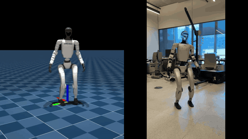

# G1 Humanoid Spinkick Training 🤸‍♂️

Train a Unitree G1 humanoid robot to perform dynamic spin kicks using reinforcement learning!



## 🚀 Quick Start

### Option 1: Google Colab (Recommended)
[](https://colab.research.google.com/github/Jonathan-321/G1Humanoid-spinkick/blob/main/g1_spinkick_training_colab.ipynb)

1. Click the badge above to open in Colab
2. Change runtime to GPU (Runtime → Change runtime type → T4)
3. Run all cells
4. Watch your robot learn to spin kick!

### Option 2: Local Training (Advanced)
Requires NVIDIA GPU with CUDA support.

```bash
# Clone the repository
git clone https://github.com/Jonathan-321/G1Humanoid-spinkick.git
cd G1Humanoid-spinkick

# Install dependencies
pip install -r requirements.txt

# Run training
python train.py
```

## 📁 Project Structure

```
G1Humanoid-spinkick/
├── g1_spinkick_training_colab.ipynb  # Main training notebook (start here!)
├── spinkick_example/                  # Custom environment configs
│   └── spinkick_env_cfg.py           # Spinkick-specific settings
├── modal_train_spinkick.py           # Cloud training with Modal
├── isaac_gym_spinkick.py             # Isaac Gym implementation
├── pkl_to_csv.py                     # Motion data converter
├── spinkick_motion.csv               # Reference motion data
└── spinkick_safe.onnx               # Pre-trained model
```

## 🎯 What This Does

1. **Motion Imitation Learning**: Teaches the G1 humanoid to perform a double spin kick
2. **Reference Motion**: Uses motion capture data converted from MimicKit format
3. **RL Algorithm**: PPO (Proximal Policy Optimization) for stable training
4. **Safety**: Includes smooth transitions and angular velocity limits

## 🛠️ Technical Details

### Environment
- **Robot**: Unitree G1 humanoid (simplified model)
- **Physics**: MuJoCo simulator
- **Action Space**: 14 joint actuators
- **Observation Space**: Joint positions, velocities, and reference pose
- **Reward**: Motion tracking + stability + energy efficiency

### Training
- **Algorithm**: PPO with Stable Baselines3
- **Parallel Envs**: 256 (scalable)
- **GPU**: T4/A100 recommended
- **Training Time**: ~30 minutes on Colab

## 📊 Results

After training, the robot learns to:
- Execute a full 360° spin kick
- Maintain balance during dynamic motion
- Follow the reference trajectory closely
- Recover to standing position

## 🔧 Advanced Usage

### Custom Motion Data
```python
# Convert your own motion data
python pkl_to_csv.py --pkl-file your_motion.pkl --csv-file output.csv
```

### Modal Cloud Training
```bash
# Train on Modal with A100 GPU
modal run modal_train_spinkick.py --num-envs 256 --max-iterations 2000
```

### Isaac Gym (Local Only)
```python
# Requires Isaac Gym installation
python isaac_gym_spinkick.py
```

## 📚 Based On

- [mjlab](https://github.com/mujocolab/mjlab) - RL framework
- [MimicKit](https://github.com/xbpeng/MimicKit) - Motion data source
- [Unitree G1](https://www.unitree.com/g1) - Humanoid robot

## 🤝 Contributing

Contributions welcome! Please feel free to submit a Pull Request.

## 📝 License

This project is licensed under the Apache License 2.0 - see the [LICENSE](LICENSE) file for details.

## 🙏 Acknowledgments

- MuJoCo team for the physics simulator
- Unitree Robotics for the G1 robot model
- Jason Peng for the MimicKit motion data

---

**Made with 🤖 by Jonathan Muhire**